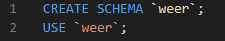
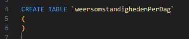
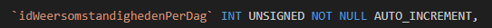
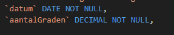
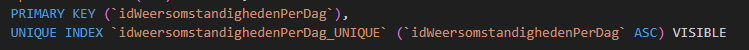

## SQL schrijven

Omdat je soms ook SQL moet kunnen gaan we deze keer de CREATE table zelf schrijven.

- Maak een `sql` file aan in `visual studio code`:
    - `weer.sql`
    - sla deze op in je `sql` directory
- we beginnen met een nieuwe database dus:
 

> #### UITLEG
> - `CREATE SCHEMA ...` maakt een nieuw schema (database)
> - `use ...` selecteerd dat schema (anders kan de database de tabellen niet vinden)

## CREATE TABLE

nu gaan we de table schrijven:

- Begin met het schrijven van:
 

> zie je die haakjes `()` daar moet alles tussen
>   - `colommen`, `datatypes`
>   - `primary keys`
>   - `indices` (sneller zoeken)

## COLOMMEN

> voorbeeld  
> de ID colom: 
>    
> het patroon is dus:
> - `NAME` (idWeersomstandighedenPerDag)
> - `DATATYPE` (`INT`) en in ons geval gevolgd door `UNSIGNED`
> - Mag het leeg zijn? (`NULL` of `NOT NULL`)
> - omdat we een `primary key` als `INT` hebben en we die niet zelf willen vullen zetten we er `AUTO_INCREMENT` achter

- zet nu dit in je `weer.sql`:
>    
- zet achter de `NOT NULL` :
    - `AUTO_INCREMENT` 

- zet daarachter:
 

- schrijf nu zelf de andere colommen:
   - `windKracht`  
   - `regenInMilimeters`  
   - `plaats`  

## PRIMARY KEY

Nu alle colommen gedaan zijn, komen we bij het laatste stukje:  
*De primary key(s) en indices*

- zet achter de `NOT NULL` van `plaats` een komma (`,`)
- daarachter zet je dit:
 

## Klaar?

- commit naar je github