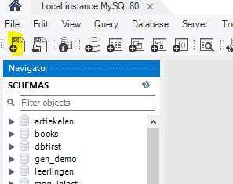
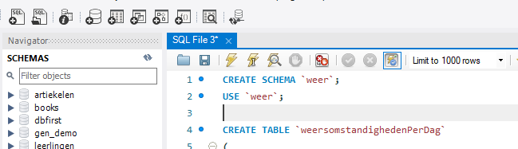
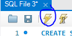
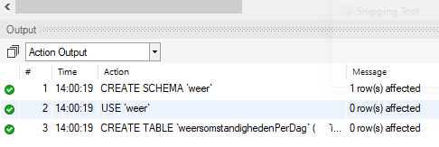
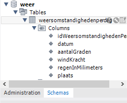

## scripts uitrollen
 
Dit is voor workbench. Op Mac kan je HeidiSql gebruiken of mysqld in de commandprompt.

## Inloggen

Nu hebben we een `sql` script.
- open `weer.sql` in je `mysql workbench` 
> Om daar iets mee te doen moeten we `inloggen` met een `gebruiker` op de `database`:
> - de gebruiker moet `CREATE SCHEMA` rechten hebben 
> - de gebruiker moet `CREATE TABLE` rechten hebben 

- click op
 

- log in met de `root`
- click op `+sql`
 

- plak je `sql` uit je `script` in het `sql text window`
 

- druk op de bliksum knop
 

## CHECK!

- check of je geen fouten hebt:
 

- ga naar je schema tab
 

- rechter muis click en kies `refresh`

- check of je table er nu staat:
 

## Php admin

> op deze manier kan je het later ook via `phpmyadmin` op jouw `docker` de `database` uitrollen

## Klaar?
- maak een `screenshot` van je `hele` workbench
    - sla die op in `screenshots` als `04 weer sql.png`
- commit naar je github