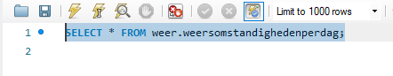
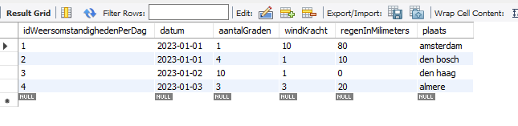
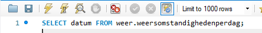

## Data

- log in met de `root`
- click op `+sql`
</br>

- plak deze `sql` in het `sql text window`
```SQL

INSERT into weersomstandighedenPerDag (`datum`,`aantalGraden`,`windKracht`,`regenInMilimeters`,`plaats`) 
values
 ("2023-01-01",1,10,80,"amsterdam"),
 ("2023-01-01",4,1,10,"den bosch"),
 ("2023-01-02",10,1,0,"den haag"),
 ("2023-01-03",3,3,20,"almere");
```

- druk op de bliksum knop
</br>


## Data selecteren

- gebruik nu een SQL select statement om data te selecteren:
</br>
- check het resultaat:
</br>

- nu gaan we de select anders maken:
</br>

- nu gaan we alleen de `datum` en het `aantalGraden` selecteren
    - TIP: je kan colommen met `,` achter elkaar zetten
- sla je query op in een nieuwe file:
    - `05 select.sql`
    - sla deze op in je `sql` directory
- maak een screenshot van de resultaten
    - sla die op in `screenshots` als `05 select.png`


## Klaar?
- maak een `screenshot` van je resultaat 
    - sla die op in `screenshots` als `05 weer php.png`
- commit naar je github
