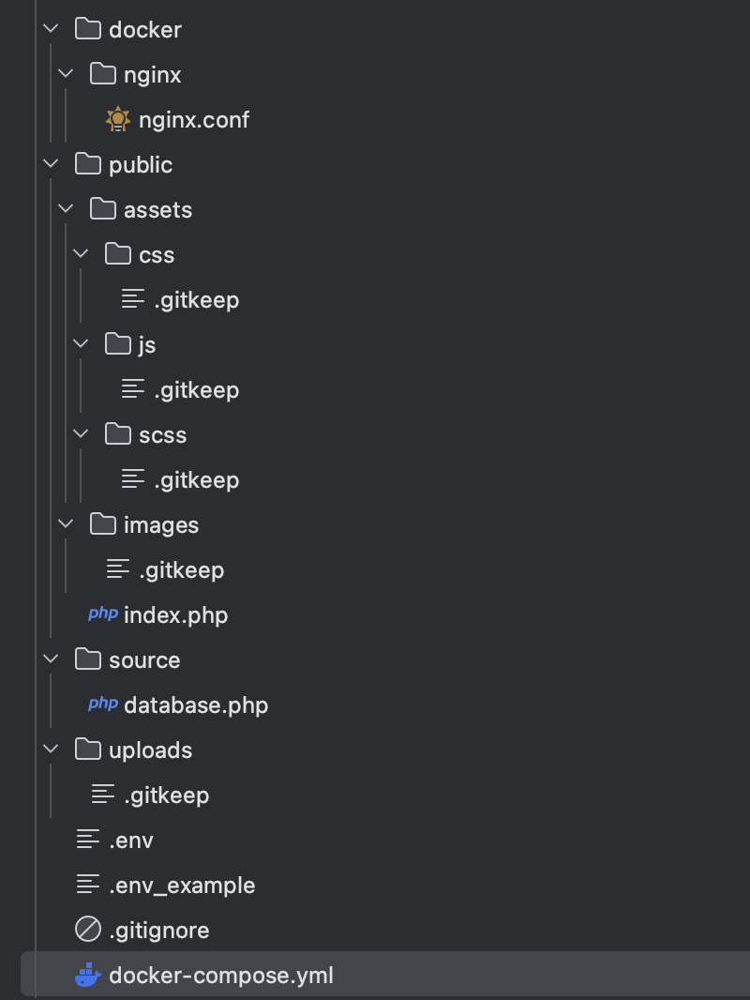

# 1/2 Project setup
- Project folder aanmaken
- Folder structuur instellen
- Git keep

## Project folder
Voor dat wij gaan beginnen met code schrijven is het belangrijk om de correcte structuur neer te zetten.  
1. Maak een project folder `m6prog_project` aan binnen de `M6PROG` folder die je gelinked hebt aan git.  
Dit is vanaf nu de root folder van het project.

## Structuur
Van te voren weten wij dat het een php-html project gaat worden, dus de structuur is redelijk bekend.
1. Navigeer naar deze folder en maak de volgende bestanden:
   - \docker\nginx *( hier komt de configuratie van nginx terecht )*
   - \public *( dit is de folder die zichtbaar is vanuit de browser )*
   - \source *( hier staan straks de bestanden met php functies )*
   - \uploads *( in latere lessen gaan wij hier bestanden naartoe uploaden )*
2. Binnen de public folder gaan wij de assets en images plaatsen:
   - \public\assets\css *( de css bestanden )*
   - \public\assets\js *( de javasript bestanden )*
   - \public\assets\scss *( de originele dynamische css bestanden )*
   - \public\images *( afbeeldingen voor de website zoals een logo of een foto )*

## Voorbeeld bestanden
Er zijn een aantal voorbeeld bestanden nodig waarmee wij straks aan de slag gaan.
Voor nu mogen dit lege bestanden zijn. Maak de volgende bestanden aan:
- \public\index.php  *( dit is straks het hoofd bestand dat door de browser gelezen gaat worden )*
- \docker\nginx\nginx.conf *( gebruik hiervoor het voorbeeld bestand: [nginx.conf](../voorbeeld_bestanden/nginx.conf) )*
- \source\config.php *( hier komen de instellingen zoals de hostname en de database login gegevens )*
- \source\database.php *( dit bestand gebruiken wij straks voor de database verbinding )*
- \\.env *( Hier komen je instellingen zoals de database login gegevens te staan )*
- \\.env_example *( Dit is een voorbeeld van hoe de structuur van de .env file eruit moet zien )*
- \docker-compose.yml *( hiermee kunnen wij de ontwikkelomgeving opzetten )*

## Git keep
Git keep is een leeg bestandje dat ervoor zorgt dat je een lege folder kunt toevoegen aan git.
Hierdoor kun je een structuur aanmaken voordat de echte bestanden straks beschikbaar zijn.
1. Maak een bestand aan met de naam .gitkeep
2. Plaats dit bestand in de volgende folders:
    - public/assets/css
    - public/assets/js
    - public/assets/scss
    - public/images
    - uploads

## Resultaat
De structuur van de folder zou er zo uit moeten zien:  

