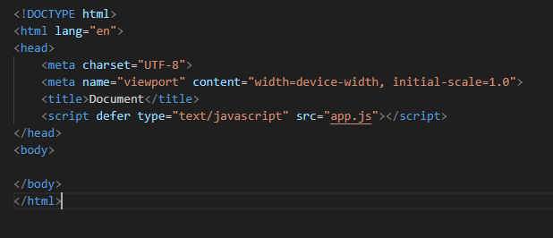
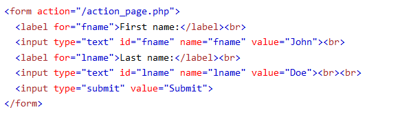
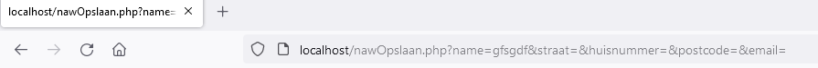

## Html

We gaan deze keer met html een formulier maken. De data uit dit formulier wordt later dan naar een server gestuurd en daar verwerkt. Denk bijvoorbeeld aan contact of nieuwe account formulieren. Maar ook een bericht op zoiets als discord gebruikt dezelfde technieken.


## HTML inhoud

laten we beginnen met het opzetten van de html:

- neem de volgende code over (in `nawform.html`)
</br>

## hoe werkt het?

- bekijk deze code: (uit w3 schools)
</br>

> - je ziet de action (`/action_page.php`) dat is het adres waar de data heengaat
> - de `label` is om het formulier leesbaarder te maken
> - het `input` element is waar de data door de gebruiker ingevoerd wordt
> - het `input` element heeft een attribuut `name`, die wordt ook meegestuurd
> - het `input` element heeft een attribuut `value`, die wordt ook meegestuurd

## NAW

- Maak nu zelf een formulier voor de volgende NAW gegevens:
    - Naam
    - Straat
    - Huisnummer
    - Postcode
    - Email adres

- toon het formulier in de browser en maak een screenshot:
    - sla die op in `screenshots` als `01 htmlform.png`

## Action

- wij veranderen nu de action naar `nawOpslaan.php`
- zet ook het volgende attribuut in je form tag:
     - `method="POST"`
- die php file maken we nu aan `nawOpslaan.php` file ook alvast
- zet alvast je php tag erin:
```php
<?php
//hier komt je code
?>
```

## Testen

- Ga in je browser naar lokale test omgeving ( docker ) en plaats de bestand naam achter de url.
- bijvoorbeeld `http://localhost:88/naw.html`
- vul wat in en click op `submit`
- controlleer of je nu naar de pagina `nawOpslaan.php` gaat:
</br>

> #### UITLEG
> Zie je dat je nu de `url` krijgt zonder `?` en `data`?
> - dit komt omdat we nu een `POST request` doen

## Klaar?
- commit naar je github
