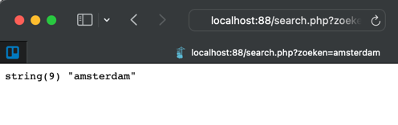

# Zoeken implementatie met php
Wij gaan nu aan de slag met het verwerken van het zoek resultaat. Dit doen wij op basis van de tabel van vorige week en het zoek formulier uit de vorige les.
- Superglobals
- $_GET
- Controle

## Superglobals
Een superglobal is binnen php overal beschikbaar. Drie voorbeelden zijn:
- $_GET
- $_POST
- $_REQUEST

## $_GET
Vanuit het zoek formulier is data verstuurd via de GET methode
    ```html
    <form action="search.php" method="get">
    </form>
    ```
In php kun je deze informatie ophalen door de superglobal $_GET aan te roepen. <br>
1. Open search.php
2. Start php
3. Gebruik een var_dump zodat niet alleen de inhoud te zien van een waarde, maar ook het datatype.
4. Plaats in de var_dump de superglobal, bijvoorbeeld:
    ```php
    var_dump( $_GET );
    ```
5. Of om het er mooier uit te zien plaats je er de pre tag omheen:
    ```php
    echo '<pre>';
    var_dump( $_GET );
    echo '</pre>';
    ```
6. Open het zoekformulier via docker: [http://localhost:88/search.html](http://localhost:88/search.html)
7. Als je het zoek formulier nu test dan zie je het volgende: <br>


## Controle
In de url waar je na het zoeken naartoe gaat is nu een get variabele zichtbaar. Deze waarde is hetzelfde als die je weergeeft via php.
1. Geef nu alleen de inhoud van het zoeken onderdeel van de GET array weer door de key te specificeren:
    ```php
    echo '<pre>';
    var_dump( $_GET['zoeken'] );
    echo '</pre>';
    ```
2. Ga nogmaals naar  [http://localhost:88/search.html](http://localhost:88/search.html)
2. Zoek nu op amsterdam
3. Zie dat de url nu het volgende is: [http://localhost:88/search.php?zoeken=amsterdam](http://localhost:88/search.php?zoeken=amsterdam)
4. In de pagina zie je nu:<br>


## Klaar?
- commit naar je github