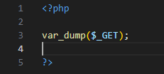
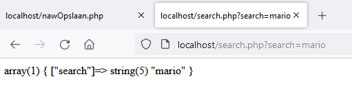
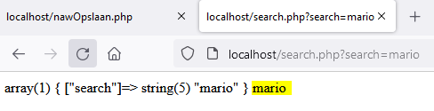
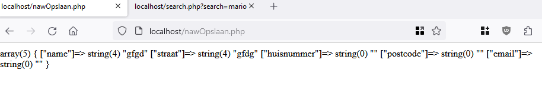
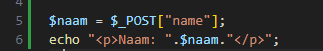
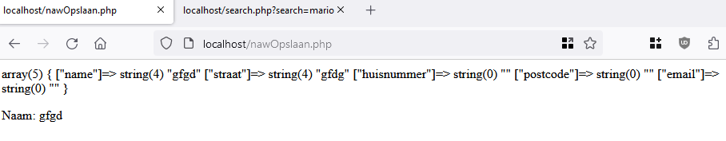
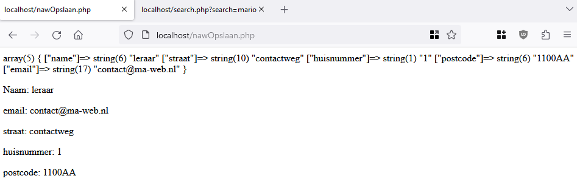

## Search

- open `search.php` in `visual studio code`
- zet de volgende code in je php:

 

## TESTEN
> - gebruik je `php -S localhost:4001`
> - open `http://localhost:4001/search.html` in je browser

- test nu je code en kijk of je dit krijgt:
 

## $_GET

in `$_GET` staan alle `variabelen` die in je `query string` staan

- zet nu eens achter `?search=mario`:
    - `&luigi=missing`

- maak een screenshot van het resultaat

- open `search.php`
- zet daar nu het volgende in:
 

> zie je hoe je nu maar `1 ding` uit de `$_GET` gehaald hebt?
> - zo kan je elk `input` veld `apart` opvragen en daar mee werken

## NAW

- open `nawOpslaan.php` 
- zet de volgende code in je php:
 

> zie je dat we nu de `$_POST` gebruiken?
> - deze werkt net als de `$_GET` alleen komt de data uit een ander stuk van de request

## Gegevens per veld

- zet de volgende code in je php:
 

## TESTEN
> - gebruik je `php -S localhost:4001`
> - open `http://localhost:4001/naw.html` in je browser

- test je code en kijk of je dit ziet:
 

> - zie je dat we nu de naam uit POST halen?
> - zie je dat we de variable $naam aanmaken?
> - zie je dat we de variable $naam gebruiken om html te maken die je dan in je browser ziet?

## Andere velden ophalen
- haal nu de andere velden ook zo op:
    - Straat
    - Huisnummer
    - Postcode
    - Email adres

## TESTEN
> - gebruik je `php -S localhost:4001`
> - open `http://localhost:4001/naw.html` in je browser

- test je code en kijk of je dit ziet:
 

## Klaar?
- commit naar je github