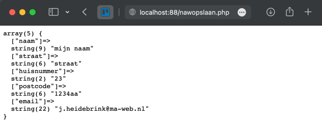
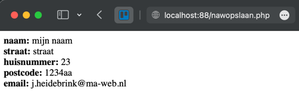
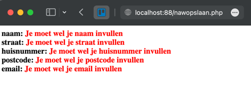

# Zoeken implementatie met php
Wij gaan nu verder met het ophalen van data. Deze keer gebruiken wij de superglobal POST
- Superglobal $_POST
- Weergave
- Controle

## Superglobal $_POST
Vanuit het formulier op nawform.html is data verstuurd via de POST methode
```html
<form action="nawopslaan.php" method="post">
</form>
```
In php kun je deze informatie ophalen door de superglobal $_POST aan te roepen. <br>
1. Open nawopslaan.php
2. Start php
3. Plaats in de var_dump de superglobal, bijvoorbeeld:
    ```php
    echo '<pre>';
    var_dump( $_POST );
    echo '</pre>';
    ```
4. Open het naw formulier via docker: [http://localhost:88/nawform.html](http://localhost:88/nawform.html)
5. Als je het formulier nu test dan zie je bijvoorbeeld het volgende: <br>
   

## Weergave
Nu gaan we het resultaat wat beter weergeven:
1. Wij werken nog steeds in nawopslaan.php
2. Geef het resultaat zo weer dat je een mooi overzicht hebt, bijvoorbeeld zo:<br>


## Controles
Nu gaan wij controleren of het data type correct is.
1. Maak een default waarde voor $naam aan
    ```php
    $naam = '';
    ```
2. Controleer of de superglobal POST een key heeft met 'naam' én of deze niet leeg is
    ```php
    if ( empty( $_POST['naam']) ) {
    
   }
    ```
3. Geef het weer als dit resultaat niet is wat je verwacht.
    ```php
    if ( empty( $_POST['naam']) ) {
        echo '<b style="color:#f00;">Naam is niet ingevuld</b>';
    }
    ```
4. Als het element wel beschikbaar is in de superglobal dan vul je de waarde van $naam met dit element:
   ```php
   } else {
      $naam = $_POST['naam'];
   }
   ```
5. Elk element zou er nu zo uit kunnen zien:
   ```php
    $naam = '';
    echo '<b>naam: </b>';
    if ( empty( $_POST['naam']) ) {
        echo '<b style="color:#f00;">Je moet wel je naam invullen</b>';
    } else {
        $naam = $_POST['naam'];
    }
    echo $naam;
    echo '<br>';
   ```
4. Doe dit ook bij de andere elementen
5. Het resultaat kan er nu zo uitzien als je niets ingevuld hebt:<br>


## Extra test
1. Open het naw formulier via docker: [http://localhost:88/nawform.html](http://localhost:88/nawform.html)
2. En controleer of alles nog werkt zoals verwacht.

## Klaar?
- commit naar je github