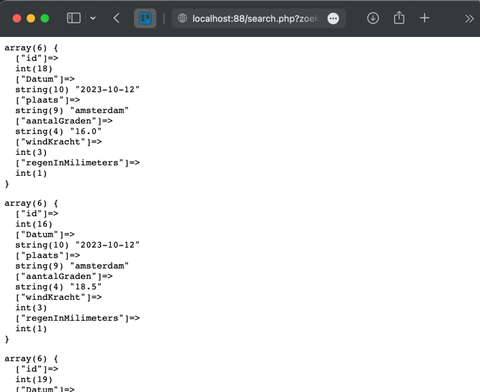
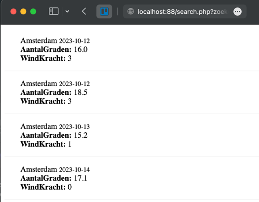

# Request combineren met de database
Wij gaan nu aan de slag met het verwerken van het zoek resultaat. Dit doen wij op basis van de tabel van vorige week en het zoek formulier uit de vorige les.
- Tabel
- MySQL verbinding
- Informatie ophalen
- Weergeven resultaat

## Tabel
Wij gebruiken de WeersomstandighedenPerDag tabel van vorige week.
1. Open phpmyadmin vanuit docker: [http://localhost:1088](http://localhost:1088)
2. Selecteer het correcte schema ( database ) `m6prog_dbaa`
3. Maak de tabel als je die nog niet hebt:
    ```sql
    CREATE TABLE `WeersomstandighedenPerDag`
    (
        `id`                int(11) unsigned NOT NULL AUTO_INCREMENT,
        `Datum`             date           NOT NULL,
        `plaats`            varchar(120)   NOT NULL,
        `aantalGraden`      decimal(10, 1) NOT NULL,
        `windKracht`        int(11) NOT NULL,
        `regenInMilimeters` int(11) NOT NULL,
        PRIMARY KEY (`id`)
    );
    ```
4. Controleer of je minimaal 3 items in de database hebt of voer deze query uit:
    ```sql
    INSERT INTO `WeersomstandighedenPerDag` (`Datum`, `plaats`, `aantalGraden`, `windKracht`, `regenInMilimeters`)
    VALUES ('2023-10-15', 'amsterdam', 15.0, 1, 0),
    ('2023-10-16', 'bussum', 16.3, 1, 0),
    ('2023-10-14', 'amsterdam', 17.1, 0, 0),
    ('2023-10-14', 'bussum', 16.0, 12, 6),
    ('2023-10-12', 'diemen', 16.0, 3, 0);
    ```

## Verbinding
1. Kopieer de alle code uit index.php
2. Plaats deze code nu in search.php 
3. Je hebt nu een database verbinding en de benodigde prepare statement

## Informatie ophalen uit de superglobal
In de php code hebben wij vorige week een placeholder variabele `$plaats` gemaakt, die gaan wij nu vullen met informatie uit de $_GET 
1. Zoek de definitie van $plaats op, ergens in de buurt van regel 25
2. Zorg er nu voor dat de waarde gevuld word met de waarde die verstuurd is.
```php
$plaats = $_GET....
```
3. Deze waarde wordt nu verderop in het script verwerkt.

## Weergeven resultaat
In de vorige les heb je onderaan de pagina 1 resultaat weergegeven. Nu plaatsen wij de dump in een while loop.
1. Ga naar de plek waar je het resultaat object omzet naar een associative array. ```$weersomstandigheden = mysqli_fetch_assoc($result);```
2. Plaats deze code in een while loop, bijvoorbeeld:
   ```php
   while( $weersomstandigheid = mysqli_fetch_assoc($result) ) {
      // geef hier $weersomstandigheid weer
   }
   ```
3. Binnen deze loop kun je nu het resultaat weergeven via de var_dump, of op een mooie manier vormgegeven.<br>

4. Of op een mooie manier:<br>


## Klaar?
- commit naar je github