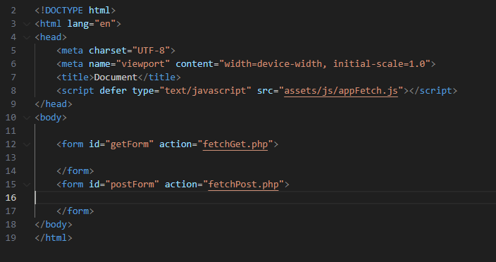
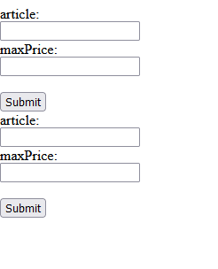

## voorbereiden

- maak in je `public` folder van je docker de volgende files:
    - `fetch.html`
    - `fetchGet.php`
    - `fetchPost.php`
    - maak een `appFetch.js` file in `assets/js` (onder `public`)
    
## html

> we gaan fetch op 2 manieren gebruiken, daar hebben we 2 formulieren voor nodig:
> - een GET formulier
> - een POST formulier

- open `fetch.html` en zet de volgende code erin
    >  

## Get form

- maak in het eerste (`getForm`) formulier de volgende velden aan:
    - een `submit` knop
    - een `input` text veld met de naam:
        - `article`
    - een `input` text veld met de naam
        - `maxPrice`

## POST form

- maak in het eerste (`postForm`) formulier de dezelfde velden aan:
    - een `submit` knop
    - een `input` text veld met de naam:
        - `article`
    - een `input` text veld met de naam
        - `maxPrice`

## Testen

- open `fetch.html` in je browser, controller of het er zo uitziet:
    >  

 ## Klaar?
- commit naar je github