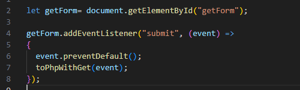
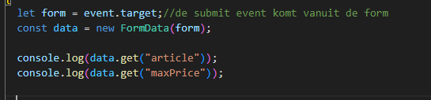
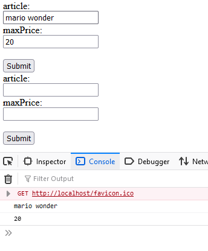
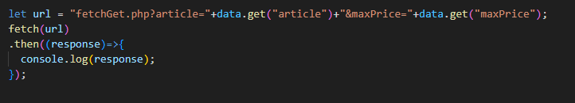
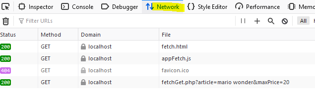
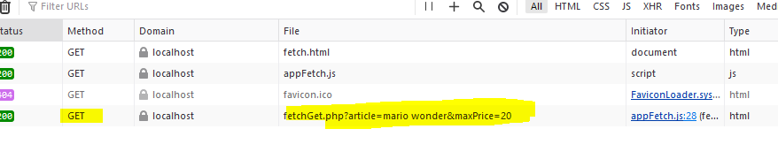

## submit event

- open `appFetch.js` en zet de volgende code erin
    >  
- maak de `toPhpWithGet` function in je javascript
- zet in de `body` van `toPhpWithGet`:
    >  

> #### UITLEG
> - zie je dat we de `event.target` in een `form variabel` stoppen, voor de `leesbaarheid`?
> - zie je dat we dan `FormData` gebruiken om `form` in te stoppen
>       - deze `Class` is een `helper class` die ons helpt het formulier te lezen
> - zie je dat we met `data.get("KEYNAME")` de `input velden` kunnen ophalen?

## Testen

- open `fetch.html` in je browser
    - vul iets in het bovenste formulier
        - druk op submit
            - controlleer in je console of je dit ziet:
                >  

## javascript post

- open je `appFetch.js`
- voeg in `toPhpWithGet` toe:
    >  

> #### UITLEG
> - zie je dat we een `url` maken?
> - zie je dat we een `query string` maken (`?a=b&G=hello`)
> - zie je dat we weer `data.get` gebruiken?

## Testen

- open je netwerk settings in je web developer tools
    >  
- druk weer op `submit`, en kijk of je de `get request` ziet verschijnen
    >  
- maak daar een screenshot van:
    - sla die op in `screenshots` als `02 get network.png`

 ## Klaar?
- commit naar je github