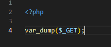
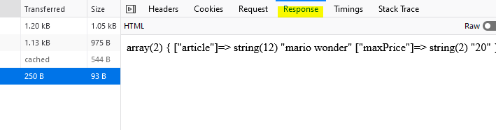
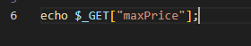

## submit event

- open `fetchGet.php` en zet de volgende code erin
    >  

## Testen

- open `fetch.html` in je browser

- open je `network` in je `web developer tools`
    >  
- vul iets in het bovenste formulier
    - druk op submit
- open je fetch get response (click)
    >  
- click op response, en kijk of je de php var dump ziet:
    >  

## waardes 1 voor 1

- open `fetchGet.php`
    - zet de var dump in commentaar (`//` ervoor)
- zet de volgende regel in je code:
    >  
- maak nog een regel aan die `article` met `echo` schrijft

## Testen

- open `fetch.html` in je browser
    - controlleer je `php response` op je `fetch`:
        - druk op submit
            - controlleer in je console of je dit ziet:
                >  

 ## Klaar?
- commit naar je github