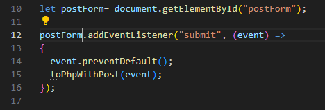
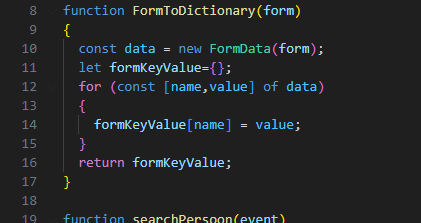
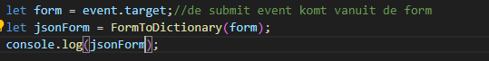
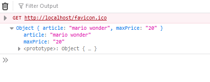
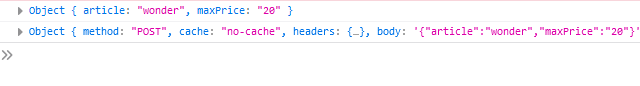
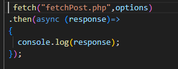
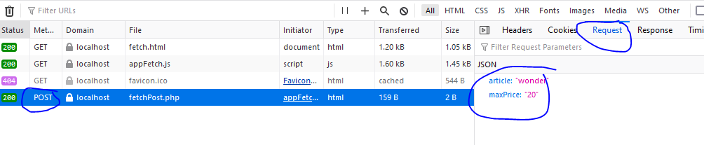

## post submit event

- open `appFetch.js` voeg de code hieronder toe:
    >  
- maak de `toPhpWithPost` function aan
- zet deze helper function ook in je code:
    >  

## toPhpWithPost

- zet nu het volgende in de body van `toPhpWithPost`:
    >  

## Testen

- open `fetch.html` in je browser
    - vul wat in het `tweede` (onderste) formulier
        - druk op `submit` en check je console:
    >  

## een post versturen

Dit is wat ingewikkelder, we gebruiken weer fetch

- open `appFetch.js`
- zet het `volgende` onderaan in `toPhpWithPost`:
    >  

> #### UITLEG
> hier maken we `options` aan, die vertellen `fetch`:
> - hoe die moet gaan versturen (`POST`)
> - wat die moet versturen (`body`)
> - zie je dat we de `jsonForm` in `JSON.stringify` stoppen? dan wordt het object een string

- `console.log` de options maar eens:
    >  

## posten

- nu gaan we `fetch` weer gebruiken, zet dit onder de options:
    >  '

> zie je dat we nu de `options` meegeven in `fetch`?

## testen

- open `fetch.html` in je browser
    - vul wat in het `tweede` (onderste) formulier
        - druk op `submit` en check je request:
    >  

 ## Klaar?
- commit naar je github