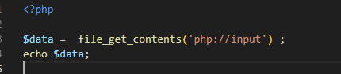
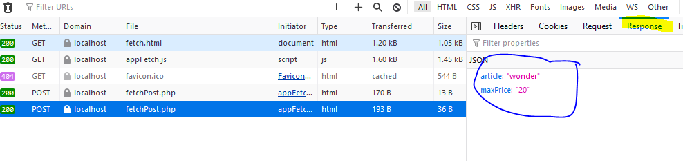
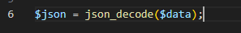
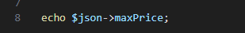
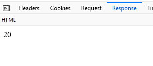
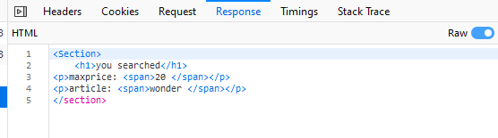

## post submit event

- open `fetchPost.php` voeg de code hieronder toe:
    >  
- check wat er terugkomt in je `network debugger`:
    >  

> #### UITLEG
> we gebruiken nu `file_get_contents('php://input') ;` 
> - dit haalt de hele body content van de httprequest op
> - kijk hieronder, zie je dat we in de options:
>   - de body toewijzen
>   - het content-type zetten?
    >  

## string naar json

> `$data` is een `string` daar kan je zo niet zoveel mee, die moeten we eerst naar een php object omzetten

- haal de echo weg door er commentaar van te maken (`// ervoor`)
- voeg het volgende in `fetchPost.php` toe
    >  

- nu kunnen we de variable `$json` gebruiken om bv `maxPrice` te lezen:
    >  
- controlleer je response:
    >  

- voeg nu `article ook toe`, maak er ook html van zie het resultaat hieronder:
    >  
> je moet misschien even het `raw` content vinkje aanzetten

 ## Klaar?
- commit naar je github