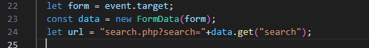
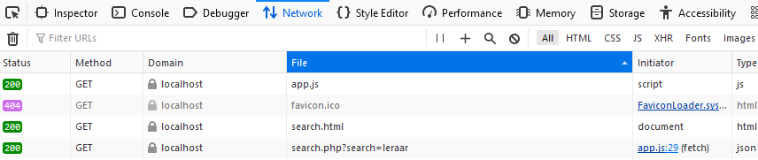
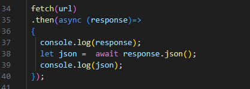

## JSON ontvangen

`searchNaw.php` geeft nu json terug. Daar kan javascript wat mee!

We gaan nu verder in `searchNaw.html`, daar gaan we met `fetch` naar `searchNaw.php`
en dan lezen we de  `response` in javascript in

## submit met javascript

- open je `searchNaw.html`
    - pas je code aan zodat het formulier een id heeft:
    >  

- open je `app.js`
    - we gaan `searchForm` selecteren en in javascript halen:
        >  

- maak een nieuwe function, gebruik deze code:
        >  

- nu zorgen we ervoor dat wij de submit afhandelen:
        >  

## STOP!

Als we nu submit clicken gaan we gewoon naar `searchNaw.php`:
- test dit

- zet nu in je `searchPersoon` function de volgende regel code:
  - `event.preventDefault();`

- test nu nog een keer
    - nu ga je niet meer door, dat willen we!
## Url maken

Nu moeten we een `url` maken, daarvoor hebben we de `search input` nodig uit het formulier.
- zet dit in je searchPersoon function:
    >  
- `console.log` de `url` en test je code:
    >  

## FETCH

- nu gaan we met fetch de data ophalen en tonen:
    >  

## searchPersoon function

nu moeten we de code gaan schrijven.

- Zet de fetch in je `searchPersoon` onder waar je de url gemaakt hebt:
    >  

- test en kijk bij je `network` in je `web developer tools` van je `browser` of je de `fetch` ziet staan:
    >  

- nu moeten we nog reageren op de fetch:
    - haal de `;` achter `fetch` weg
    - ga naar de `volgende` regel (enter), en type daar:
    >  

> #### UITLEG
> - `fetch` levert een `promise` op, met then `reageer` je op wanneer de fetch `klaar` is, een beetje zoals een `event`
> - tussen de haken van `then` staat een nieuwe `anonieme function`
>       - het argument van de function is `response` wat het resultaat van de fetch is

## TEST!

- test en kijk of je dit krijgt:
    >  

## JSON

nu nog de JSON lezen

- pas je then aan naar dit stuk code:
    >  

> nu blijven we op de `searchNaw.html`, maar gaan wel naar `searchNaw.php`, en krijgen `data` terug. Dat is hoe veel moderne sites werken!

## Klaar?
- commit naar je github
