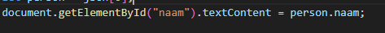

## JSON naar HTML

Cool we hebben nu JSON data welke uit de database gekomen is. Maar nu nog een resultaat laten zien toch?

## HTML klaarmaken

- open je `searchNaw.html`
    - voeg een `section` tag toe ONDER je formulier (dus naar de `</form>`)
- geef die section voor elke column in `naw`:
    - een paragraaf `
`
    - geef elke paragraaf een `id` gelijk aan de naam van de colom
    >  `

> - nu kunnen we maximaal 1 persoon weergeven wat voor nu ok is

## json data in html

- open je `app.js`
    - maak een function `ShowPersoon`
        - met 1 argument: `json` \
- roep (call) show persoon in de `then` van `fetch` aan:
    >  `

- in de json zit een `array` met daarin personen:
    - haal de persoon op `[0]` eruit
        - stop die in een variable `let person`
> dit maakt naam, postcode en andere eigenschappen makkelijker om op te vragen anders krijg je dingen zoals dit:
> `json[0].naam`

- laten we met naam beginnen:
    - we halen de paragraaf op met javascript:
    >  `
    - daarna zetten we de text in de paragraaf op de naam:
    >  `
- doe dit ook voor:
    - id
    - straat
    - huisnummer
    - postcode
    - email

## TESTEN

- test door te zoeken, dan krijg je iets zoals dit:
    >  `

- zoek een van je eigen verzonnen personen en maak een screenshot:
    - sla die op in `screenshots` als `displayperson.png`
    
## Klaar?
- commit naar je github
