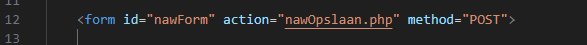
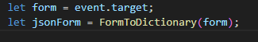
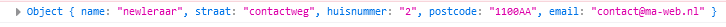
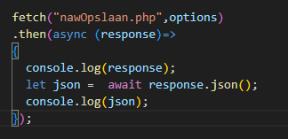
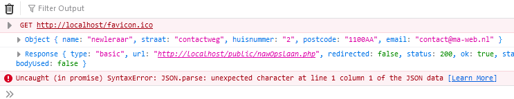
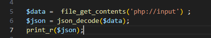
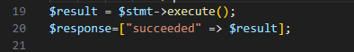
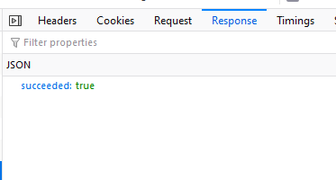

## JSON naar HTML

Nu nog een persoon kunnen maken. Dat doen we met het NAW formulier

## HTML klaarmaken

- open je `naw.html`
- zorg dat je form een `id` heeft zoals hieronder:
    > </br>`

- zorg dat je de volgende data kan invoeren met `input` velden:
    > - `naam` 
    > - `email`
    > - `straat` 
    > - `huisnummer` 
    > - `postcode`


## voorbereiden

- maak een  `appNaw.js` file in `assets/js`
- pas in `naw.html` de javascript file aan:
    > </br>`
    
## javascript post


- open je `appNaw.js`
- voeg deze function toe:
    > </br>`
- we moeten nu de submit weer vangen:
    > </br>`
- maak de `addPerson` function die je in het plaatje hierboven ziet


## POST naar nawOpslaan

- gebruik `event.preventDefault` om ervoor te zorgen dat je niet naar `nawOpslaan.php` gaat in je browser
    - test!
- haal weer het formulier op:
    > </br>`
> zie je dat we nu die helper function gebruikt?
- log `jsonForm` met `console.log`
    > </br>`

- we moeten een `fetch` options maken, hiermee kunnen we een `POST` maken:
    > </br>`

> Zie je daar die `content-type` header weer? Die staat weer op `application.json`

- we maken een fetch:
    > </br>`

## testen

- test door het formulier in te vullen en te checken of je ongeveer dit krijgt:
    > </br>`
> - die error komt omdat onze `nawOpslaan.php` nog niet goed is

## PHP

- open je `nawOpslaan.php`
    - haal alles weg behalve de `<? php` tag

- nu gaan we de json uit de request plukken:
    > </br>`

## TEST

- vul het formulier in en check of je in je response (networking web dev tool) je json ziet:
    > </br>`

- include je `database.php` (zie ook `search.php`)
- maak een database connectie object `$conn` (zie ook `search.php`)

- neem deze code over:
    > </br>`
- vul de ... in
    - achter `naw` tussen de `()`, daar komen de colommen
        - `id` hoeft niet! die is `autogenerated`
    - achter `values` tussen de `()` daar komen de `?`, van de prepared statement
        - goed tellen hoeveel je nodig hebt!
    - achter `bind_param` tussen de `""` daar komen welke datatypes je hebt
        - weer evenveel als het aantal colommen!
> HINT: check ook je `insert sql` script!

## TEST!

- test of je iets kan toevoegen, kijk of je tabel meer data heeft
    > </br>`

## Response

we zijn op een API achtige manier bezig, JSON heen.. JSON terug

dus laten we dat zo even maken:
- ga naar je `nawOpslaan.php`
    - haal `print_r($json);` weg
- verander je code naar:
    > </br>`

- kijk nu in `search.php`, hoe je json terugstuurt 
    - stuur in `nawOpslaan.php` `$response` terug als `json`:
    > </br>`

- Dit doe je door de json header toe te voegen én je resultaat weer te geven, bijvoorbeeld:
```php
header('Content-Type: application/json; charset=utf-8');
echo json_encode( $mijn_variabele_array );
```


 ## Klaar?
- commit naar je github
