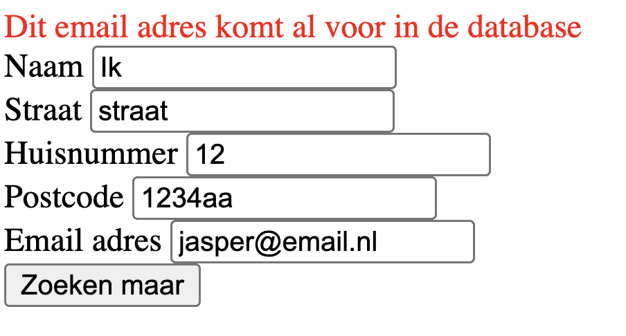

## Maximaal aantal inschrijvingen én weergeven van een resultaat

Momenteel kan iemand met één email adres zich onbeperkt inschrijven. Dit gaan wij voorkomen.


## Email adres controleren
Voordat je de data gaat opslaan moet je nu eerst controleren of het email adres al voorkomt in de database, als dit het geval is dan mag de data niet toegevoegd worden.
1. Open je `nawOpslaan.php`
2. Je hebt al een verbinding met de database, dus je kunt nu boven de insert een controle uitvoeren. 
3. Maak een select query net zoals je bij de `search.php` hebt. 
4. Controleer hoeveel resultaten je terug krijgt, hiervoor kun je bijvoorbeeld deze query gebruiken:
```sql
SELECT COUNT(1) as count FROM naw WHERE email=?
```
5. Het resultaat haal je op met:
```php
$count = mysqli_fetch_assoc($result);
```
6. Daarna kun je met de variabele `$count['count']` controleren hoeveel resultaten er zijn.
7. Dit kun je met JSON terug geven zodat je vervolgens in de HTML het de error kunt opvangen, zoals hier:
```php
if ($count['count'] > 0) {
    echo json_encode([
        'success' => false,
        'count' => $count['count'],
        'error' => 'Dit email adres komt al voor in de database'
    ]);
    return false;
}
```

## data uit JSON verwerken
Nu is het tijd om de data te verwerken. De fetch pas ik nu zo aan dat je ook de data kan gaan verwerken en niet alleen de responce opvangt.
```javascript
fetch("nawopslaan.php", options)
    .then(response => response.json())
    .then(data => {
        if (false === data.success) {
            alert('niet goed');
            return false;
        }
        console.log( 'Je data is toegevoegd met id:' + data.id );
    })
    .catch(error => console.error(error));
```

Als dit allemaal gelukt is dan zie ik dit zie ik in de html:
 > </br>`


## Resultaat weergeven
Zorg dat je na het submitten van het resultaat kunt zien wel id er aangemaakt is door het id op te halen van de laatst toegevoegde rij.
```php
$insert_id = $stmt->insert_id;
```

 ## Klaar?
- commit naar je github
