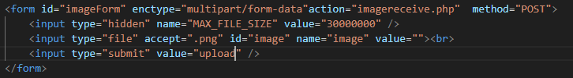
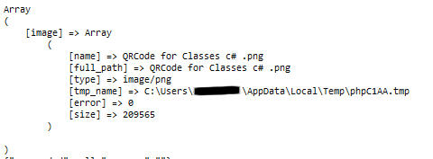
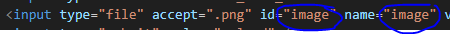
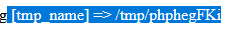
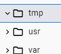
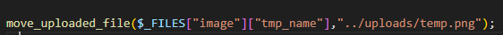
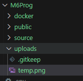

## Images uploaden

we gaan nu ervoor zorgen dat we een image kunnen uploaden naar PHP

## HTML

- maak een nieuwe html file onder je `public` van je docker:
    - `imageupload.html`

- zet in je html:
> </br>

#### UITLEG
> - zie je dat we een enctype daar nu hebben staan? deze hebben we nodig om groter files te kunnen sturen
> - we hebben ineens 2 nieuwe types:
>        - `hidden`
>        - `file`
> - ook hebben we een `accept` attribute bij de `file` input
>   - voor nu accepteren we alleen `.png` files


## php


- maak een nieuwe php file onder je `public` van docker:
    - `imagereceive.php`
- zet daar je standaard php tag in:
```php
<?php
//code komt hier
?>
```

- zet in je PHP voor nu dit neer:
> </br>

## testen

- open `imageupload.html` in je browser
- upload een `png` en kijk naar wat je terugkrijgt van php:
> </br>


#### UITLEG
> In Files zit dus:
> - een array (`[]`) bij de key `image`
>       - `image` is wat in ons formulier staat:
        > </br>
> verder zit er nog meer in:
> - `file size`, hoe groot is het plaatje in bytes
> - `tmp_name` waar staat de file op de server
> - `type`, welke `extensie` heeft de `file`
> - `error`, deze moet op `0` staan, anders is er iets mis

## Docker en files

> #### UITLEG
> als we dit in docker doen krijgen we te zien dat de file in `/tmp` staat:  
>   
> alleen als we daar kijken in docker zit er niets in   
>   
> dat komt omdat die file op linux meteen gedelete wordt

- controlleer dat:
    - open je `nginx` container in `docker desktop`
    - zoek op hoe je de files van de container kan zien
    - bekijk je `/tmp` dir
        > 

## file bewaren

- open `imagereceive.php`
    - voeg het volgende toe:
        > 
> de `["image"]` is de `name` van je `upload input` in je `html form`


## testen 2

- open `imageupload.html` in je browser
- upload een `png` en kijk naar wat je terugkrijgt van php:

- ga naar je `uploads` directory:
    > 

- open het plaatje
    - lukt dat? mooi je upload heeft gewerkt!
    
 ## Klaar?
- commit naar je github
