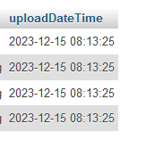
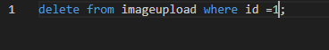
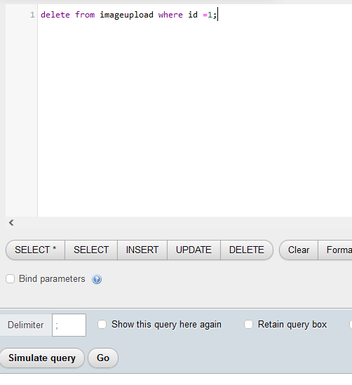
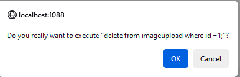
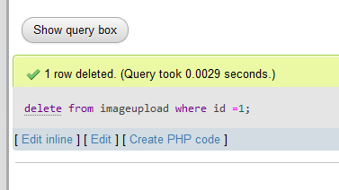

## Images uploaden

> Nu hebben we gevoelige data in onze database: fotos  
> die moeten we ook na een tijdje weer opruimen

## SQL

- maak een nieuw file aan:
    - `03 image insert.sql`

- open `03 image insert.sql`
    - maak daar `4 insert` statements
        > - je file mag nu nog even onzin zijn
        - `uploadDateTime` en je `id` mag je `NIET` invoeren
            - deze moeten automatisch gaan als je imagetable goed is

## uitvoeren en checken

- voer de `inserts` uit met `phpmyadmin` of `mysql workbench`
    - op je `DOCKER` database!

- check of er data in zit en of je `uploadDateTime` goed staat:

>  

## opruim SQL

> met delete statements kunnen we een rij weghalen
> - je begint met `delete from`
> - daarna je `tablename`
> - dan `WAT` je wil weghalen, dat is een `WHERE` 
>   - bijvoorbeeld: 
>       - `WHERE id = 1`
>       - `WHERE file = 'mijnfile.png'`

- maak een nieuwe file:
    - `03 delete proberen.sql`
        - zet daar het volgende in:
        
        >  
- probeer nu die `SQL` uit in je `docker database`
    >  
    - dan vraag phpmyadmin of je het echt wil:
    >  
    - en dan krijg je hoeveel er gedelete waren:
    >  

> Dit is een standaard om rijen op id te deleten maar het kan ook op andere manieren:
> - bijvoorbeeld op datum...
> - dat is handig voor opruimen:
>   - `delete` `alles` wat *ouder is* dan `vandaag - x dagen`

## zelf een delete maken

- maak nu in `03 delete proberen.sql`
    - een `delete` met een `WHERE` die `1` van de `andere colomme`n gebruikt

- probeer dat uit

 ## Klaar?
- commit naar je github
