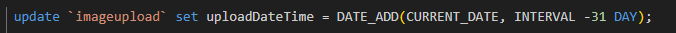

## Extra data

- voer je inserts nog een keer uit
    > - nu heb je weer data voor het volgende

## datum rekenen

> onze data is allemaal van vandaag, we willen deze in het verleden hebben
- maak een nieuwe file:
    - `03 update.sql`
    - zet daar het volgende in:
    >  
    - probeer die statement uit
        > ` update `imageupload` set uploadDateTime = DATE_ADD(CURRENT_DATE, INTERVAL -31 DAY); 
 ` dit moet even via `phpmyadmin` niet `workbench`
        - maak een screenshot
            - sla die op in `screenshots` als `05 update date.png`

    
> `DATE_ADD(CURRENT_DATE, INTERVAL -31 DAY);` is een mysql function.
> - we geven eerst welke datum we mee willen rekenen : `CURRENT_DATE`
> - daarna geven we aan HOE we willen rekenen:
>   - met een interval van `X dagen`: 
>       - *`INTERVAL` ... `DAY`*
>   - en we willen het eraf halen `-`: 
>       - *`-`31 DAY*

- we kunnen ook met `vandaag` rekenen:
    >  
    - zet die ook in `03 update.sql`
    - probeer die statement uit
        - maak een screenshot
            - sla die op in `screenshots` als `05 update datenow.png`

## jaren?

- zorg nu dat je `1 jaar` van de `uploadDateTime` haalt
    - zet die ook in `03 update.sql`
    - probeer die statement uit
        - maak een screenshot
            - sla die op in `screenshots` als `05 update year.png`
        
 ## Klaar?
- commit naar je github
