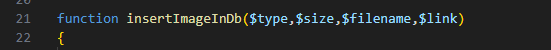
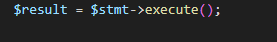
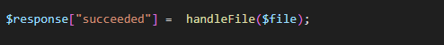
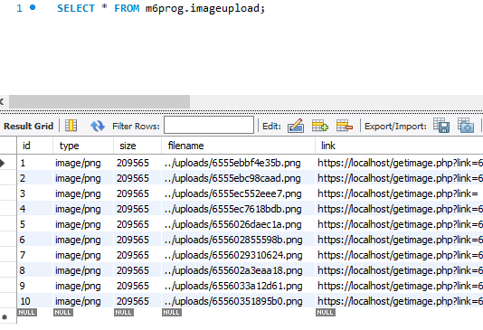
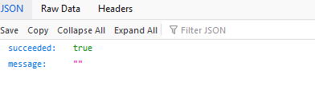

## Opslaan die hap!

- open `imagereceive.php`

- maak daar een nieuwe `function` in:
>  
- vul de function in zodat:
    - deze de `data` in je `database` zet!
    - gebruik `prepared statements`
    - vergeet je `database.php` niet!
- Check of je `$stmt->execute gelukt` is:
    - hier komt een `boolean` uit, die `true` is als alles goed ging
>  

- zorg dat die `boolean` in de `$response` komt:
    - denk aan je `return(s)`
    >  

## TESTEN
- Controlleer of je nu rijen in je datatable krijgt:
    >  
- en of je `succeeded` ook in je `browser` op true staat:
    >  

    
 ## Klaar?
- commit naar je github
