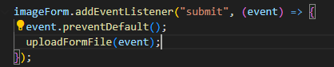
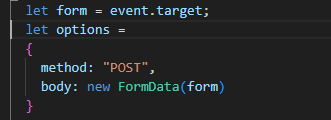
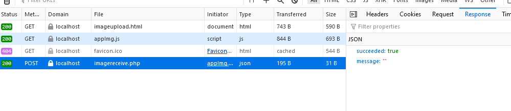

## Nu met javascript

Weten we nog dat we met `fetch` bezig waren?
tijd om dat weer te doen

deze keer zonder `json` omdat `files` wat lastiger zijn

- maak in `assets/js` een nieuwe file:
    - `appImg.js`
- open `appImg.js`
- kopieer de `FormToDictionary` function er weer in
    - of gebruik `modules` dat mag ook
- haal je `imageForm` weer op
    - net als in `appNaw.js` of `app.js`
    - verander wel de namen!

## addEventlisteren

nu gaan we de eventListener bouwen:
>  

- maak een nieuwe function `uploadFormFile` en zet daarin:
>  

> #### UITLEG
> - zie je dat we bijna hetzelfde doen als in `appNaw.js`?
> - alleen geven we meteen de `FormData` aan de `body`?

- tijd voor `fetch`, je hebt weer een `options`.. doe na wat in `appNaw.js` gebeurt om te posten
    - post wel naar `imagereceive.php` NIET naar `nawOpslaan2.php`

## TESTEN
    
- upload een plaatje
    - ga je naar de `php` of blijf je op de `html`?
        - controlleer ook je `console.log` 
            >  
        - en `network`
            >  

        
 ## Klaar?
- commit naar je github
