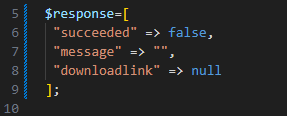
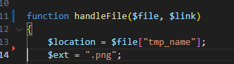
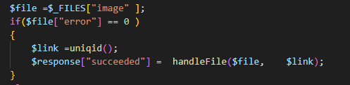
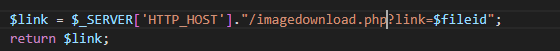
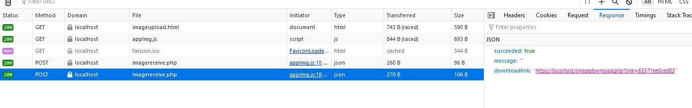

## image opvragen

Nu willen we dat mensen later het plaatje kunnen downloaden
we moeten dan:
> - zorgen dat de mensen een link kunnen krijgen

## link?

> - we hebben een file in uploads staan
> - deze file is niet beschikbaar
> - maar heeft een unieke filename
> We gaan een php maken die de file inleest, nadat iemand een de filename in een querystring heeft meegegeven

- open je `imagereceive.php`
    - pas `$response` aan zodat er ook een link mee terugkomt:
        >  

## link maken

> om de link te maken moeten we de `$link` variable gaan verhuizen uit `handleFile` naar een hoger niveau

- verander je code van `handleFile` naar:
    >  
    > zie je dat de `$link` nu als `argument` staat?
- we moeten nu de `$link` weer aanmaken, dat doen we hier:
    >  
    > we maken de `$link` aan en geven die weer door aan `handleFile`

## In de response JSON

- kijk naar deze code:
    >  
    > we kunnen dus met `$response["downloadlink"] = "..."` de link zetten
- dat gaan we doen, maak eerst de link in een nieuwe function:
    - noem de function `createLink`
    - deze heeft 1 argument:
        - `$fileid`
    - zet dit in de body:
    >  
- zet nu de `downloadlink` in de `$response`
    - alleen als `$response["succeeded"]` op `true` staat!

## testen

- upload een plaatje, check of je een link in je response meekrijgt:
    >  

    
 ## Klaar?
- commit naar je github
