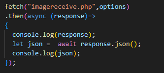
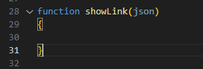
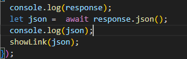
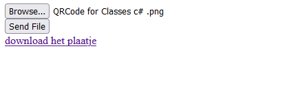

## We hebben de link

- open je `imageupload.html`
    - zet daar een nieuw element in:
        - `a` , met id `link`

## JS

> nu moeten nu de `response` die we in javascript krijgen gaan lezen
- open `appImg.js`
- ga naar de fetch code daar heb je dit staan:
    >  
- we moeten nu iets met die `json` doen, maak een nieuwe `function` aan:
    >  
- roep nu `showlink` alvast aan:
    >  

## ShowLink

> nu moeten we onze `a` by id selecteren en dan daar de link inzetten 
> - zorg dat de `text` wordt: `"Download het plaatje"`

- doe dit in de `showlink` function:
    - HINTS:
        - `document.getElementById`
        - `textContent`
        - `setAttribute("href",...)`

## testen

- upload een plaatje, check of je de link nu te zien krijgt:
    >  

- click op de link, dat zou nog niet helemaal moeten werken:
    >  

    
 ## Klaar?
- commit naar je github
