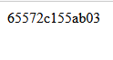
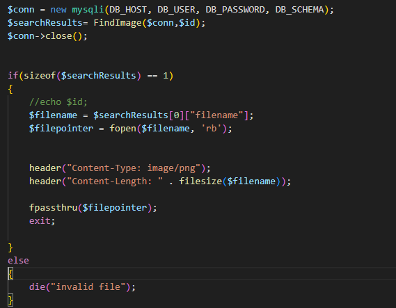
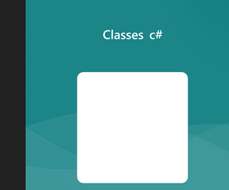

## JS

- maak in je `public` in je docker maak je een file:
    - `imagedownload.php`
- kijk naar:
    >  
    - zie je de `querystring` dus wat achter de `?` staat.
- gebruik nu `$_GET` om `link` te pakken en die in een nieuwe `$id` te stoppen
- echo de `$id` even en check of je dit krijgt:
    >  

## nu het plaatje

- haal je echo weer weg (met commentaar `//`)
- zorg dat je de function `GetQueryResultsAssoc` uit `search.php` in `imagedownload.php` zet
- kopieer ook `FindPersoon($conn,$name)` uit `search.php` in `imagedownload.php` 

> #### UITLEG
> we gaan nu FindPersoonLike aanpassen zodat we het plaatje uit de database selecteren
> - dit doen we op basis van `$id`
> - dan pakken we de `filename` uit de database (door ons gemaakt)
> - zo voorkomen we dat mensen de waarde van `$id` manipuleren

## database aansluiten

- kijk na of je in je image table de filename opgeslagen hebt
    - zo niet? maak die erbij
- pas `FindPersoon` naar `FindImage`
- pas de `query` aan zodat deze het plaatje met de `$id` selecteerd

- neem nu deze code over:
    >  

#### UITLEG
> - we krijgen een resultaat uit de database
> - daar hebben we als het goed is een `filename` opgeslagen
> - daarna gebruiken we de `php` `file classes` om het `plaatje` te openen
> Versturen
> - om de php `response` als `plaatje` te laten werken moeten we de `headers` anders zetten
>       - net als de `application/json`, weet je nog? 
> - daarna is er een function `fpasstru` die de `file content` (`bytes`) doorstuurt in de `response`

## testen

- test en kijk of je je plaatje nu ziet als je op de download link clickt:
    >  

 ## Klaar?
- commit naar je github
