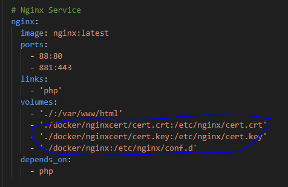
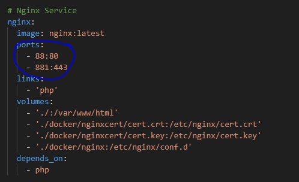
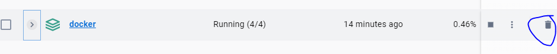
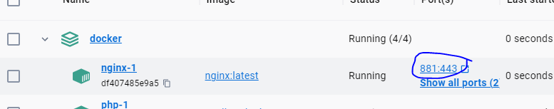
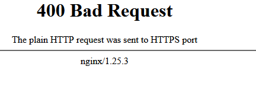
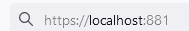

## naar de NGINX container

#### UITLEG
> nu moeten deze certificaten naar de NGINX container
> daarvoor moeten deze de container in laten kopieeren

- open je `docker-compose.yml`
    - voeg het volgende toe:
        > </br>
- pas ook je `ports` aan
    - `- 881:443` moet erbij (zie plaatje hierboven)
        > </br>

## zet NGINX ssl aan

- nu open je `docker\nginx\nginx.conf`
- zet de code hieronder `onderaan` in die file
```

server {
    listen              443 ssl;
    server_name         localhost;
    ssl_certificate     cert.crt;
    ssl_certificate_key cert.key;
    ssl_protocols       TLSv1 TLSv1.1 TLSv1.2 TLSv1.3;
    ssl_ciphers         HIGH:!aNULL:!MD5;

    root /var/www/html/public;
    index index.php index.html;

    # Support Yii2 pretty URL routing
    location / {
            try_files $uri $uri/ =404;
            if (!-e $request_filename){
                    rewrite ^/(.*) /index.php?r=$1 last;
            }
    }

    location ~* \.php$ {
        fastcgi_pass php:9000;
        include fastcgi_params;
        fastcgi_param SCRIPT_FILENAME $document_root$fastcgi_script_name;
        fastcgi_param SCRIPT_NAME $fastcgi_script_name;
    }

    # Prevent additional headers like TRACE, DELETE, PUSH
    if ($request_method !~ ^(GET|HEAD|POST)$ )
        {
            return 405;
        }
}
```

> dit zorgt ervoor dat NGINX ook naar de SSL poort gaat luisteren en daar de HTTP requests serveert

## container opnieuw

- delete je container 
> </br>
- `docker compose` je container weer
- maak je `tables` opnieuw


## TESTEN

We gaan nu testen of we bij onze https kunnen
- click op de `881:443`
> </br>
- je krijgt misschien een `400`:
> </br>
- maak van je url `https`:
> </br>

## WARNING

omdat deze certificaten niet goed zijn krijg je warnings.
- voeg een tijdelijke uitzondering toe (het is ons eigen certificaat)
- test nogmaals:
> </br>
    


 ## Klaar?
- commit naar je github
