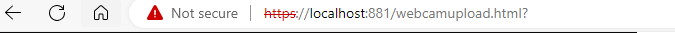

## naar de NGINX container

#### UITLEG
> nu moeten deze certificaten naar de NGINX container
> daarvoor moeten deze de container in laten kopieeren

- open je `docker-compose.yml`
    - voeg het volgende toe:
        >  
- pas ook je `ports` aan
    - `- 881:443` moet erbij (zie plaatje hierboven)
        >  

## container opnieuw

- delete je container 
>  
- `docker compose` je container weer
- maak je `tables` opnieuw

## TESTEN

We gaan nu testen of we bij onze https kunnen
- click op de `881:443`
>  
- je krijgt misschien een `400`:
>  
- maak van je url `https`:
>  

## WARNING

omdat deze certificaten niet goed zijn krijg je warnings.
- voeg een tijdelijke uitzondering toe (het is ons eigen certificaat)
- test nogmaals:
>  
    

 ## Klaar?
- commit naar je github
