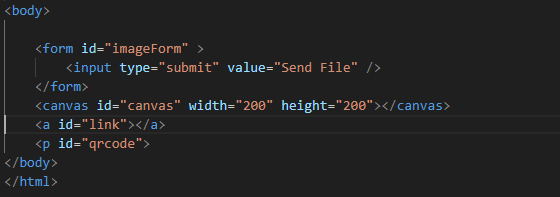
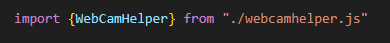

## webcamhelper

> omdat de webcam api wat ingewikkeld kan zijn heb ik een helper class gemaakt:  
>  - [webcamhelper.js](./webcamhelper.js)

- download `webcamhelper.js` en zet deze in je `assets/js/`

## html maken

- maak in `public` de volgende `html` file
    - `webcamupload.html`
- zet daar de standaard html vulling in 
    - `HINT`: type `!` in visual studio code

- zet het volgende in de `body`:
    >  

## app

- maak een nieuwe file in `assets/js/`:
    - `appWebcam.js`
- koppel die op de standaard manier aan je html
    - HINT:
        - `script` tag
        - vergeet je `defer` niet
- check of je `type` op `module` staat, niet op `text/javascript`
## importeren

> - we hebben nu een  `webcamhelper.js` maar die moeten we in onze code importeren

- zet het volgende boven in je `appWebcam.js`:
    >  

## TESTEN

- zorg dat je `docker` draait
- open `edge` of `chrome`
    - open de link https://localhost:881/webcamupload.html
- check je console op fouten
    - alles check? dan kan je door

 ## Klaar?
- commit naar je github
