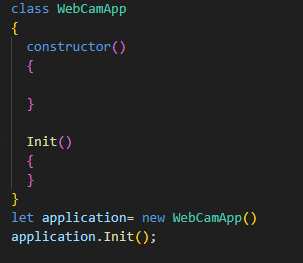
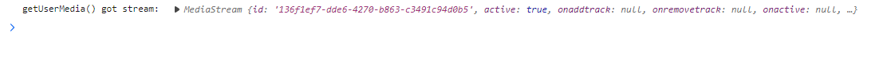
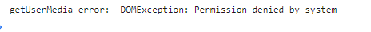

## WebCamApp

- `appWebcam.js`
> hierin gaan we een nieuwe class maken die alles regelt voor onze applicatie

## Class maken

- zet het volgende in je javascript file
    >  

> #### UITLEG
> - we hebben nu een nieuwe class `WebCamApp` gemaakt
> - die hebben we een constructor gegeven
>   - daarin maken we de class variablen die bij die class horen
> - we hebben een `Init` function gemaakt om de applicatie op te starten
> - als laatst maken we een `instance` van onze `WebCamApp` 
>   - en gebruiken die om de application met `Init` op te starten

## constructor

> we gaan nu de `constructor` function invullen

- maak 3 nieuwe variabelen met `this.` ervoor:
    - `imageForm`
        - geef met `=` de waarde:
            - `document.getElementById("imageForm");`
    - `downloadLink`
        - geef met `=` de waarde:
            - `document.getElementById("link");`
    - `webapi`
        - geef met `=` de waarde:
            - `new WebCamHelper();`

> Nu hebben we alles klaar staan in de class

## Init

> we gaan nu de `Init` function invullen

- de webapi heeft een function `startApi`
    - roep die aan met:
    >  

## Testen

- open de link https://localhost:881/webcamupload.html
- open je debugger
- zie je ondergeveer dit? *(de id mag verschillen)*
>  

> FOUTEN
> een andere mogelijke fout is:
>  
> dan heb je je camera `NIET` aanstaan in je `PERMISSIONS` (system settings)

## Klaar?
- commit naar je github
