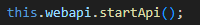
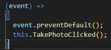
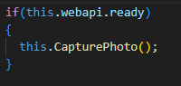
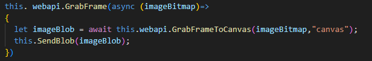
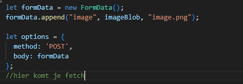

## Init

> je hebt nu in je `init` dit staan:
    >  

- daaronder doe je op `this.imageForm` een :
    - `addEventListener`
    - met eventnaam `submit`
    - gebruik als `2de` argument:
    >  

## TakePhotoClicked

> die `TakePhotoClicked` function hebben we nog niet

- maak die function en zet dit in de `body`:
    >  

> #### UITLEG
> - onze `webapi` heeft een `.ready` boolean.
> - deze wordt op `true` gezet als alles klaar is
> - het klaar zetten gebeurt op de `achtergrond` terwijl onze code doorloopt
> - als je op `submit` clicked terwijl de api `niet klaar` is, dan `crashed` het

## CapturePhoto

> deze `CapturePhoto` function hebben we ook nog niet

- maak die function en zet dit in de `body`:
    >  

## SendBlob

> je raad het al `SendBlob` hebben we ook nog niet

- maak die function en zet dit in de `body`:
    >  
- deze is nog niet klaar
    - zorg dat je een fetch doet naar `imagereceive.php`
- log de `response  + json` in the `.then`

## Link tonen

- maak een function:
    - `ShowLink`
    - met 1 argument:
        - `json`
- roep deze aan in de `.then` van je `fetch`
    - geef de `json` uit de response mee
        - HINT: `await response.json()`

- zorg nu dat:
    - je de `downloadlink` in de `json` in:
        - de `link` in je html zet en dus laat zien
    - je een qrcode maakt
> *HINT*:  zie `opgave 7`

## Klaar?
- commit naar je github
